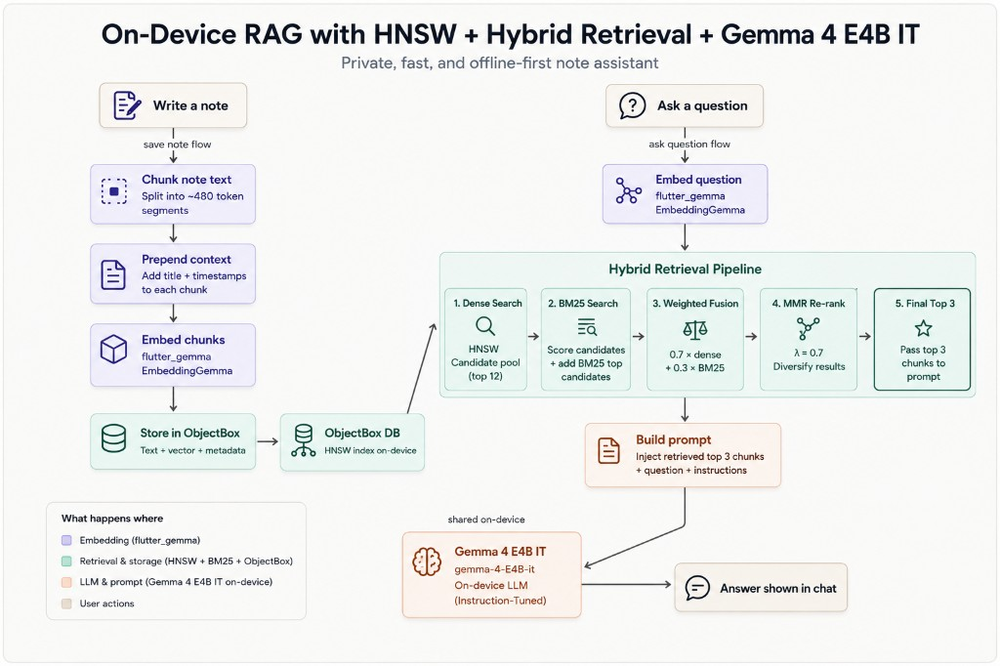

# Smart Notes

Flutter app for **local notes** with **on-device RAG** (retrieval-augmented generation). Notes are chunked, embedded, and stored on-device; the chat retrieves relevant passages and answers with a **Gemma** model running locally—no cloud LLM required for inference.

## Features

- **On-device models** — First-run setup downloads **Gemma** (inference) and **EmbeddingGemma** (vectors) via `flutter_gemma`; models stay on the device after setup.
- **Private RAG chat** — Ask questions over your notes; answers use retrieved chunks only, with **chunk citations** and **Markdown**-friendly replies (`gpt_markdown`).
- **Semantic note graph** — Visual graph of notes linked by **embedding similarity** (ObjectBox + heuristics for large libraries); explore how notes relate without manual tagging.
- **Note workspace** — Create and edit notes, **search** the library, and browse in a **staggered grid** layout.
- **Material 3** — Light/dark themes with a consistent indigo seed palette (`GetX` for routing and state).

## Requirements

- **[FVM](https://fvm.app/)** — This repo pins the Flutter SDK via [`.fvmrc`](.fvmrc) (currently the **`stable`** channel). Use FVM so everyone runs the same toolchain.
- **Hugging Face token (recommended)** — **EmbeddingGemma** is gated. Create a token, accept the model license on Hugging Face, then pass the token at run time (see [Quick start](#quick-start)).
- **Targets** — iOS / Android / desktop per your Flutter install; device storage for model files.

## Quick start (FVM)

1. **Install FVM** (once per machine), if needed:

   ```bash
   dart pub global activate fvm
   ```

   Ensure `fvm` is on your `PATH` (see [FVM install docs](https://fvm.app/documentation/getting-started/installation)).

2. **Clone and enter the project:**

   ```bash
   git clone <repository-url>
   cd smart_notes
   ```

3. **Install the Flutter SDK version from `.fvmrc`** (creates `.fvm/flutter_sdk`; this folder is gitignored):

   ```bash
   fvm install
   ```

4. **Get dependencies:**

   ```bash
   fvm flutter pub get
   ```

5. **Hugging Face token (for EmbeddingGemma)**  
   Copy the example config and add your `hf_...` token:

   ```bash
   cp config.json.example config.json
   # Edit config.json — set "HUGGINGFACE_TOKEN" (do not commit real secrets)
   ```

6. **Run the app** (defines are read in `main.dart` / setup):

   ```bash
   fvm flutter run --dart-define-from-file=config.json
   ```

   Without a token, Gemma may still download but the embedder step can fail with auth/license errors; the setup screen explains this.

### Useful commands

| Task | Command |
|------|---------|
| Doctor | `fvm flutter doctor` |
| Tests | `fvm flutter test` |
| Codegen (after changing ObjectBox entities) | `fvm dart run build_runner build --delete-conflicting-outputs` |

IDE tip: the repo includes [`.vscode/settings.json`](.vscode/settings.json) pointing Dart at `.fvm/flutter_sdk` when you use FVM’s local SDK.

## Architecture

On-device RAG uses `flutter_gemma` for embeddings and inference (**EmbeddingGemma** + **gemma-4-E4B-it**), **ObjectBox** as the local vector store (HNSW), and **hybrid retrieval** (dense + BM25, fusion, and MMR) before prompting.



### Save note flow

1. **Write a note** — user creates content.
2. **Chunk note text** — split into segments (about 480 tokens).
3. **Prepend context** — title and timestamps are attached to each chunk.
4. **Embed chunks** — `EmbeddingGemma` (`flutter_gemma`) produces vectors.
5. **Store in ObjectBox** — text, vectors, and metadata are indexed (HNSW) for search.

### Ask question flow

1. **Ask a question** — user query in chat.
2. **Embed question** — same `EmbeddingGemma` model as for notes.
3. **Hybrid retrieval** — dense HNSW pool (top 12), BM25 scoring, weighted fusion (`0.7 × dense + 0.3 × BM25`), MMR re-rank (λ = 0.7), then **top 3** chunks for the prompt.
4. **Build prompt** — retrieved chunks, the question, and instructions (`RagService`).
5. **Gemma 4 E4B IT (on-device)** — instruction-tuned model via `flutter_gemma`.
6. **Answer in chat** — response is shown to the user.

## Project layout (high level)

- `lib/features/setup` — first-run model download and warmup.
- `lib/features/notes` — list, editor, search.
- `lib/features/chat` — RAG-backed Q&A.
- `lib/features/graph` — semantic similarity graph UI.
- `lib/services` — chunking, embeddings, vector store, RAG, graph logic.
- `lib/data` — ObjectBox models and store.

## License / third-party

Model weights and Hugging Face terms apply to downloaded artifacts; use your app’s license for this repository’s code as you choose.
